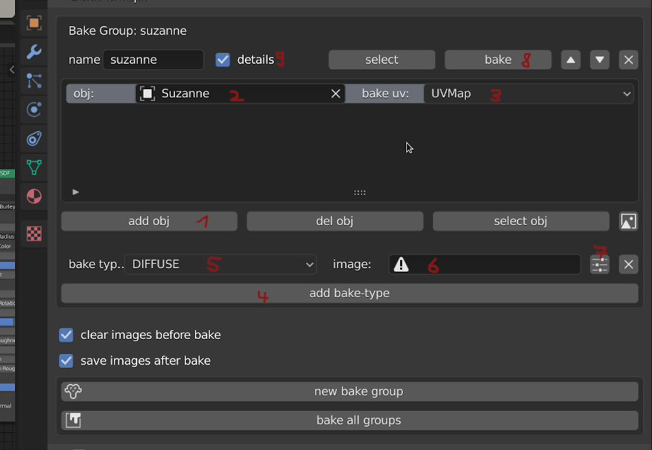
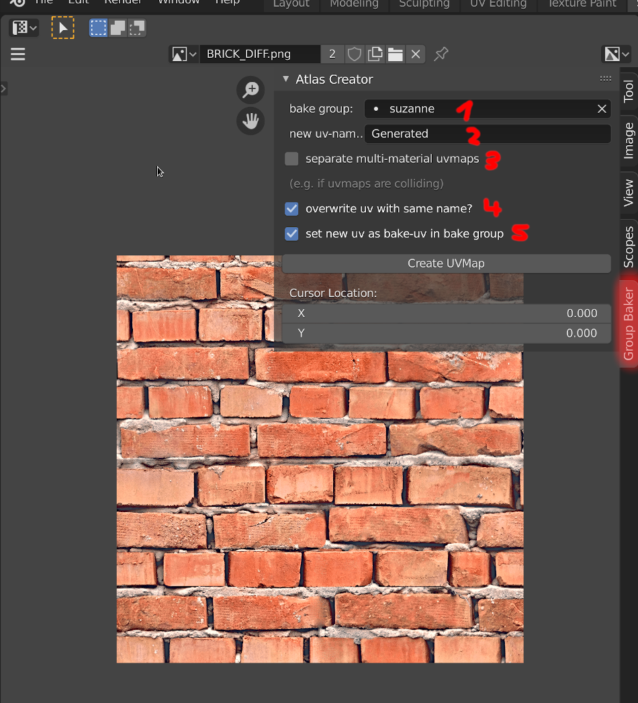

# addon_bake_groups

Install: 
* [download as zip](https://github.com/dertom95/addon_bake_groups/archive/master.zip)
* open blender > edit > preferences > addons > install... > select downloaded zip-file
* search for 'bake' or and select 'Bake Groups':

How to use:
In order to render your material to textures you obviously need: 
1) a valid uvmap on your mesh
2) images to render onto
3) Set render-engine to cycles: scene-properties->render-engine cycles
4) find 'bake groups'-panel: 

  
  
2 = Create 'bake group'  
3 = process all(!) 'bake groups' and bake its textures (*blender will become unresponsive during the whole process! This might take a while. The only feedback can be seen in the console*)   
1 = save the textures afterwards. **Caution:** The textures need to have a valid filepath (saved somewhere or loaded it from file)  
  
  
Once you created a 'bake group' you can:  
1 = add slot to the bakegroup for which the material should be baked to the textures. Adding multiple objects will try to bake all materials to the specified texture(s)   
2 = select object for this slot   
3 = the uv-map used for baking (if building multiple objects make sure its uvmaps do not intersect)  
4 = add bake-type   
5 = choose type of baking( 'DIFFUSE', 'ROUGHNESS', 'AO', 'SHADOW', 'NORMAL', 'UV', 'EMIT', 'ENVIRONMENT', 'COMBINED', 'GLOSSY', 'TRANSMISSION', 'SUBSURFACE' )  
6 = choose the image this bake-command should bake to 
7 = show influence-options (if bake-type has any)  
8 = bake this group only (*blender will become unresponsive during the whole process! This might take a while. The only feedback can be seen in the console*)  
9 = hide/show all the details   
  
If using multiple materials that intersect their uvmaps or using multiple objects to build a atlas-map you can use the 'atlas creator'. You can find it in the uveditor's sidebar (toggle with 'n'-key)
  
1 = select 'bake group'  
2 = specify name for the uvmap to be generated  
3 = separate uvmaps so they have their own space (only needed if uvmaps intersect)  
3a) using the 'pack multi-materials on one uv-slot' will use the space for one object and pack all material-uvmaps onto it.  
4 = remove uvmaps with the same name before (re)generating a new one  
5 = automatically set 'bake uv-map' for each object in the bake-group to the new one
'Create UVMap' = Generates the new uvmap and shows it immediately  
  
VIDEO:  
[Small video overview how to use the plugin](https://www.youtube.com/watch?v=OiZdR0Z24b8&feature=youtu.be)

